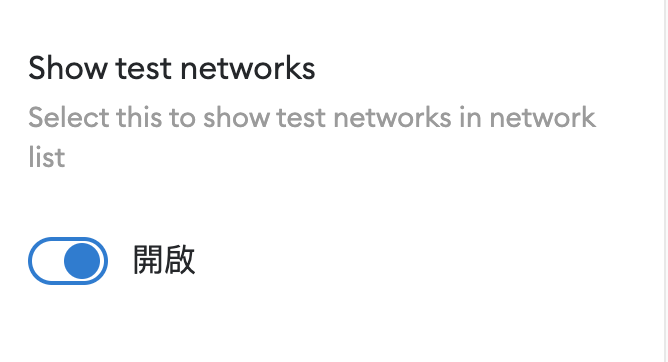
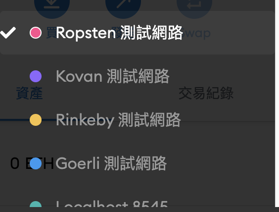

# Introduction &middot; [](https://travis-ci.org/joemccann/dillinger) [](https://docs.soliditylang.org/en/v0.8.0/) [](https://docs.ethers.io/v5/) [](https://tailwindcss.com/)

Using Web 3.0, Solidity and Metamask build a Web 3.0 Application

[Demo](https://web3-transaction.4everland.store/index.html)

## Getting Started

```tsx
cd client/
npm i
npm run dev
```

## Get rETH

> Open metaMask Show test networks button



> Change to ropsten test networks



> Enter this [website](https://faucet.egorfine.com/) and enter your ropsten address

## Tool

- Background color - https://www.csshero.org/
- Icon - https://react-icons.github.io/react-icons
- Hardhat - https://hardhat.org/
- Ropsten testnet faucet - https://faucet.egorfine.com/
- Hardhat Ropsten - https://dashboard.alchemyapi.io/
- Gif - https://developers.giphy.com/